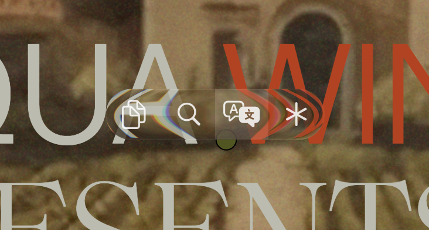
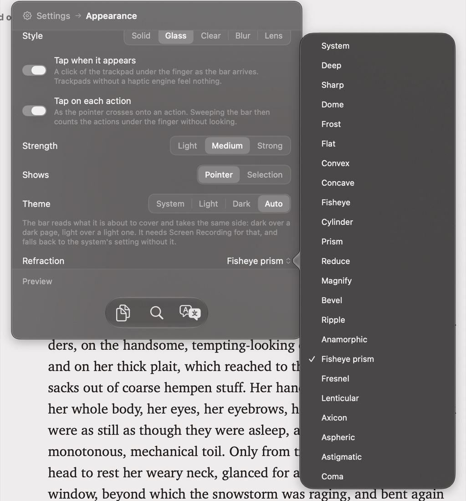

# SelectBar

Select text in any app and the actions you need appear right next to the cursor.

**[Download SelectBar.zip](https://github.com/yjujq/SelectBar/releases/latest/download/SelectBar.zip)**

## What it does

- A small bar of buttons appears when you let go of the mouse after selecting text: copy, search, translate, read aloud, open a link.
- 57 actions to choose from — text changes (UPPERCASE, Title Case, sort lines, Base64…), search sites, dictionaries, translators, Notes, Reminders, Things, Todoist and more. Seven are on to begin with.
- Add your own: open any URL with the selected text in it, or run a shell command.
- Make it yours: size, opacity, tint, light / dark / auto theme, and Solid, Glass, Blur or Lens styles.
- Optional trackpad taps as the bar appears and as the pointer crosses each action — Light, Medium or Strong.
- Stays out of the way: it never takes focus, ignores single clicks and password fields, and lives in the menu bar with no Dock icon.

## Manual



1. **Select text** in any app and let go of the mouse — the bar appears right by the pointer.
2. **Click an action.** Any click elsewhere, or a new selection, puts the bar away.
3. **Click the menu bar icon** for settings: **Actions** turns actions on and off and adds your own; **Appearance** sets the size, style, theme, refraction and the trackpad taps.



## Install

1. Download **SelectBar.zip**, unzip it and move **SelectBar.app** to Applications.
2. Open it. The app is not notarized, so macOS stops it the first time: open **System Settings → Privacy & Security** and click **Open Anyway**.
3. Grant Accessibility when asked — the bar starts working the moment you do.

## Requirements

macOS 26. Tested on a MacBook Pro M3 Pro.

## Permissions

- **Accessibility** — required, to read the selected text.
- **Screen Recording** — only for the Lens style and the Auto theme.
- **Automation** — macOS asks the first time you use the Notes or Reminders actions.

## Limits

- The bar shows only where an app exposes its selection through Accessibility; text in images is not supported.
- It appears on mouse release — there is no keyboard shortcut for it.

## Build from source

```sh
./build.sh && open /Applications/SelectBar.app
```

Swift, AppKit and SwiftUI, no dependencies. For an Xcode project, run `xcodegen generate`.

## Privacy

SelectBar collects nothing and sends nothing anywhere. The selected text leaves your Mac only when you pick an action that opens a website — search, translate, maps — and then it goes to that site in your browser.

## License

MIT — see [LICENSE](LICENSE).
